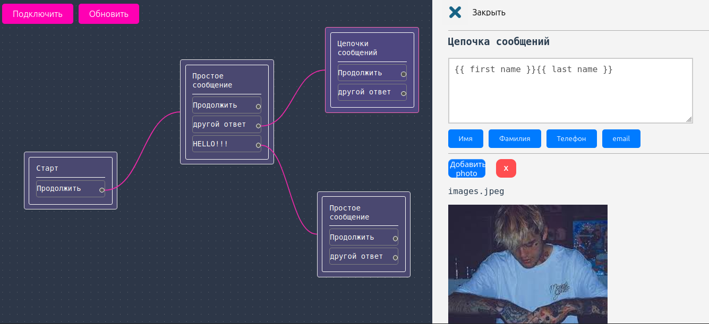
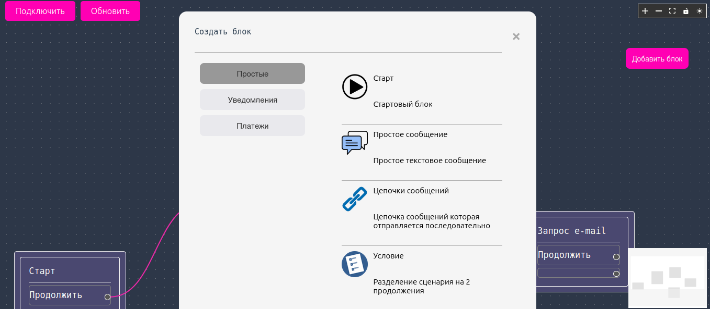

# TelegramBotsConstructorSource

<p align="center">
  
</p>


⚠️ **Project Status: Source Code (As-Is)**
> **Important:** This project did not reach production. The code is "raw," messy in places, experimental, and currently represents solely an archive of source code without final polish. 
> 
> This repository was created to preserve work-in-progress. Pull Requests and fixes are welcome, but the project is provided as is (without guarantees of stable operation).

---

## 🚀 Project Description

**TelegramBotsConstructor** is the source code for a visual Telegram bot constructor. The main concept was to create an intuitive tool that allows users to assemble, configure, and launch their own Telegram bots through a visual interface or configuration files without deep programming knowledge.

### 🛠️ Tech Stack & Features
* **Frontend:** `Vue.js` & `vue-flow` (used for building the node-based visual management interface and bot logic structure).
* **State Management:** `Pinia` / `Vuex` (located in `stores/Mystore.js`).
* **Build Tool:** `Vite` for fast development and bundling.
* **Containerization:** `Docker` (Multi-stage build support for quick production deployment).

---


<p align="center">
  
</p>

## 📂 Project Structure

```text
./
├── index.html
├── jsconfig.json
├── package.json
├── package-lock.json
├── public/
│   └── favicon.ico
├── README.md
├── src/
│   ├── App.vue
│   ├── assets/
│   │   └── exit.png
│   ├── components/         # Visual builder blocks and UI nodes
│   │   ├── CustomNode.vue
│   │   ├── JustMessage.vue
│   │   ├── MyIcon.vue
│   │   ├── SideBar.vue
│   │   ├── TheAdd.vue
│   │   ├── TheAnswer.vue
│   │   ├── TheApplication.vue
│   │   ├── TheButtons.vue
│   │   ├── TheChain.vue
│   │   ├── TheCondition.vue
│   │   ├── TheContacts.vue
│   │   ├── TheCreate.vue
│   │   ├── TheEmailSend.vue
│   │   ├── TheEmail.vue
│   │   ├── TheFast.vue
│   │   ├── TheInputs.vue
│   │   ├── TheMenu.vue
│   │   ├── TheModal.vue
│   │   ├── TheName.vue
│   │   ├── TheNot.vue
│   │   ├── TheNumber.vue
│   │   ├── ThePay.vue
│   │   ├── TheSend.vue
│   │   ├── TheStart.vue
│   │   ├── TheText.vue
│   │   ├── TheToggle2.vue
│   │   ├── TheToggle.vue
│   │   └── TheVal.vue
│   ├── initial-elements.js # Mock/Initial state for vue-flow
│   ├── main.css
│   ├── main.js
│   └── stores/
│       └── Mystore.js
└── vite.config.js
```

---

## 💻 Getting Started

### Local Development Mode (Dev)
If you want to tinker with the code and run the project locally with hot-reload:

1. **Install dependencies:**
   ```bash
   npm install
   ```

2. **Start the local development server:**
   ```bash
   npm run dev
   # or 'npm run serve' depending on the lockfile environment
   ```

---

## 🐳 Docker Deployment

To build and run the frontend part in an isolated production-ready container:

1. **Build the production image (Multi-stage build):**
   ```bash
   docker build -t telegram-bots-constructor .
   ```

2. **Run the container (accessible on port 8080):**
   ```bash
   docker run -it -p 8080:80 --rm --name bots-constructor-app telegram-bots-constructor
   ```

---

## 🛑 Known Issues and TODO

- [ ] **Refactoring:** The code requires extensive refactoring (lots of "hacks" and temporary solutions).
- [ ] **Features:** Final integration of some visual modules and nodes is missing.
- [ ] **Docker / Nginx:** Nginx configuration in the `Dockerfile` needs adaptation if you plan to use Vue Router in history mode.
